# Flow Diagrams
## Distributed Task Scheduler - Visual Flows

---

## 1. System Architecture Overview

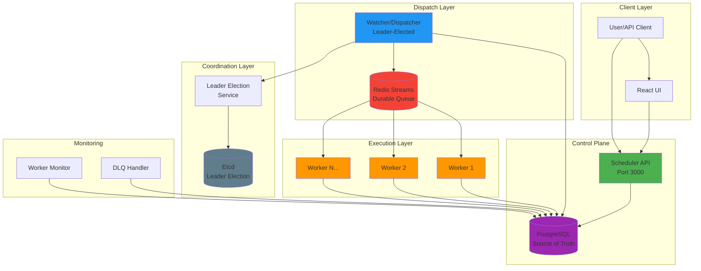

---

## 2. Job Lifecycle State Machine

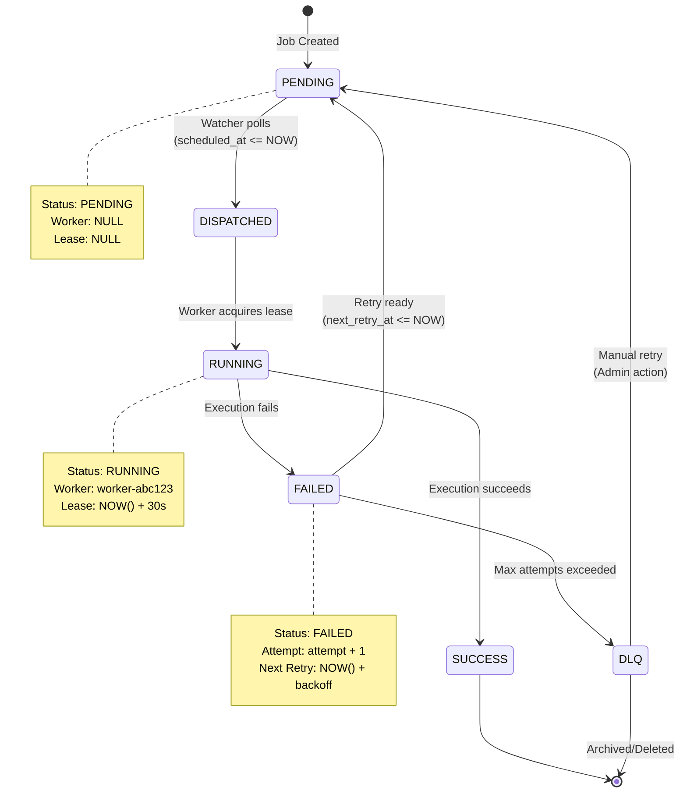

---

## 3. End-to-End Job Flow

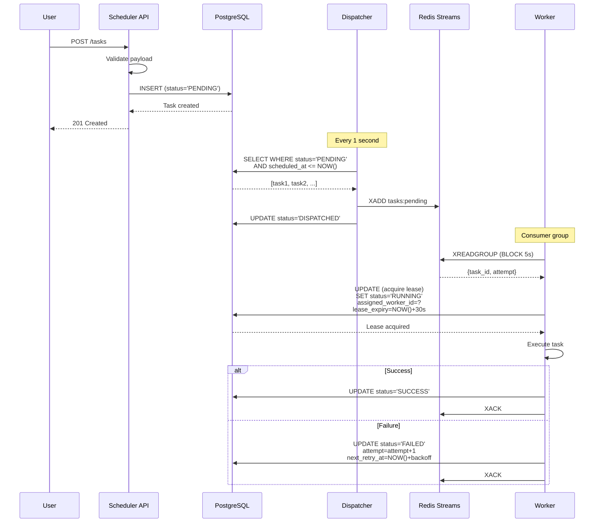

---

## 4. Dispatch Loop Flow

```mermaid
flowchart TD
    Start([Dispatcher Loop<br/>Every 1s]) --> CheckLeader{Is Leader?}
    
    CheckLeader -->|No| End([Sleep 1s])
    CheckLeader -->|Yes| QueryDB[Query DB:<br/>SELECT * FROM tasks<br/>WHERE status='PENDING'<br/>AND scheduled_at <= NOW()]
    
    QueryDB --> HasTasks{Tasks found?}
    HasTasks -->|No| End
    HasTasks -->|Yes| GetEpoch[Get Leader Epoch]
    
    GetEpoch --> LoopTasks[For each task]
    LoopTasks --> PushRedis[XADD to Redis Streams]
    PushRedis --> AddToList[Add to dispatchedIds]
    AddToList --> MoreTasks{More tasks?}
    
    MoreTasks -->|Yes| LoopTasks
    MoreTasks -->|No| BatchUpdate[Batch UPDATE:<br/>SET status='DISPATCHED'<br/>WHERE id IN (...)]
    
    BatchUpdate --> LogSuccess[Log: Dispatched N tasks]
    LogSuccess --> End
    
    style Start fill:#4CAF50
    style CheckLeader fill:#FFC107
    style PushRedis fill:#F44336
    style BatchUpdate fill:#9C27B0
```

---

## 5. Worker Execution Flow

```mermaid
flowchart TD
    Start([Worker Loop]) --> Consume[XREADGROUP from Redis<br/>BLOCK 5s]
    
    Consume --> GotMsg{Message?}
    GotMsg -->|No| Start
    GotMsg -->|Yes| CheckDB[Query DB:<br/>Get task by ID]
    
    CheckDB --> AlreadyDone{Status = SUCCESS?}
    AlreadyDone -->|Yes| Ack[XACK message]
    Ack --> Start
    
    AlreadyDone -->|No| AcquireLease[UPDATE tasks<br/>SET status='RUNNING'<br/>assigned_worker_id=?<br/>lease_expiry=NOW()+30s<br/>WHERE lease_expiry < NOW()]
    
    AcquireLease --> GotLease{Lease acquired?}
    GotLease -->|No| Start
    GotLease -->|Yes| StartRenew[Start lease renewer<br/>Every 10s]
    
    StartRenew --> Execute[Execute task]
    Execute --> Success{Success?}
    
    Success -->|Yes| UpdateSuccess[UPDATE status='SUCCESS']
    UpdateSuccess --> StopRenew[Stop lease renewer]
    StopRenew --> Ack
    
    Success -->|No| CalcBackoff[Calculate backoff:<br/>min(1000 * 2^attempt, 60000)]
    CalcBackoff --> UpdateFailed[UPDATE status='FAILED'<br/>attempt=attempt+1<br/>next_retry_at=NOW()+backoff]
    UpdateFailed --> StopRenew
    
    style Start fill:#4CAF50
    style Execute fill:#FF9800
    style UpdateSuccess fill:#4CAF50
    style UpdateFailed fill:#F44336
```

---

## 6. Retry Loop Flow

```mermaid
flowchart TD
    Start([Retry Loop<br/>Every 5s]) --> CheckLeader{Is Leader?}
    
    CheckLeader -->|No| End([Sleep 5s])
    CheckLeader -->|Yes| QueryRetry[Query DB:<br/>SELECT * FROM tasks<br/>WHERE status='FAILED'<br/>AND next_retry_at <= NOW()]
    
    QueryRetry --> HasRetry{Tasks found?}
    HasRetry -->|No| End
    HasRetry -->|Yes| LoopRetry[For each task]
    
    LoopRetry --> CheckAttempts{attempt >= max_attempts?}
    
    CheckAttempts -->|Yes| MoveDLQ[UPDATE status='DLQ'<br/>dlq_reason='Max attempts']
    MoveDLQ --> LogDLQ[Log: Task moved to DLQ]
    LogDLQ --> MoreRetry{More tasks?}
    
    CheckAttempts -->|No| ResetPending[UPDATE status='PENDING'<br/>next_retry_at=NULL<br/>assigned_worker_id=NULL]
    ResetPending --> LogRetry[Log: Task reset for retry]
    LogRetry --> MoreRetry
    
    MoreRetry -->|Yes| LoopRetry
    MoreRetry -->|No| End
    
    style Start fill:#4CAF50
    style MoveDLQ fill:#F44336
    style ResetPending fill:#2196F3
```

---

## 7. Leader Election Flow

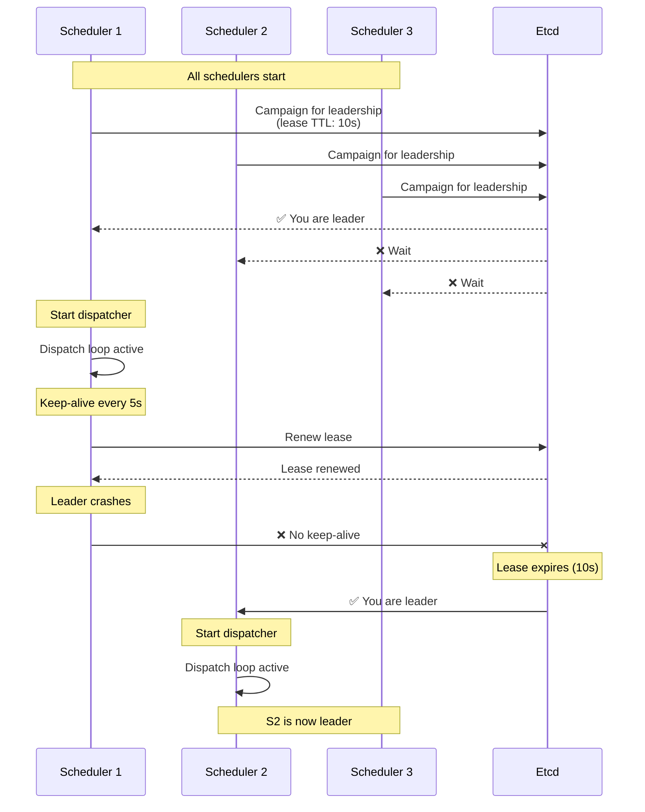

---

## 8. Lease-based Execution

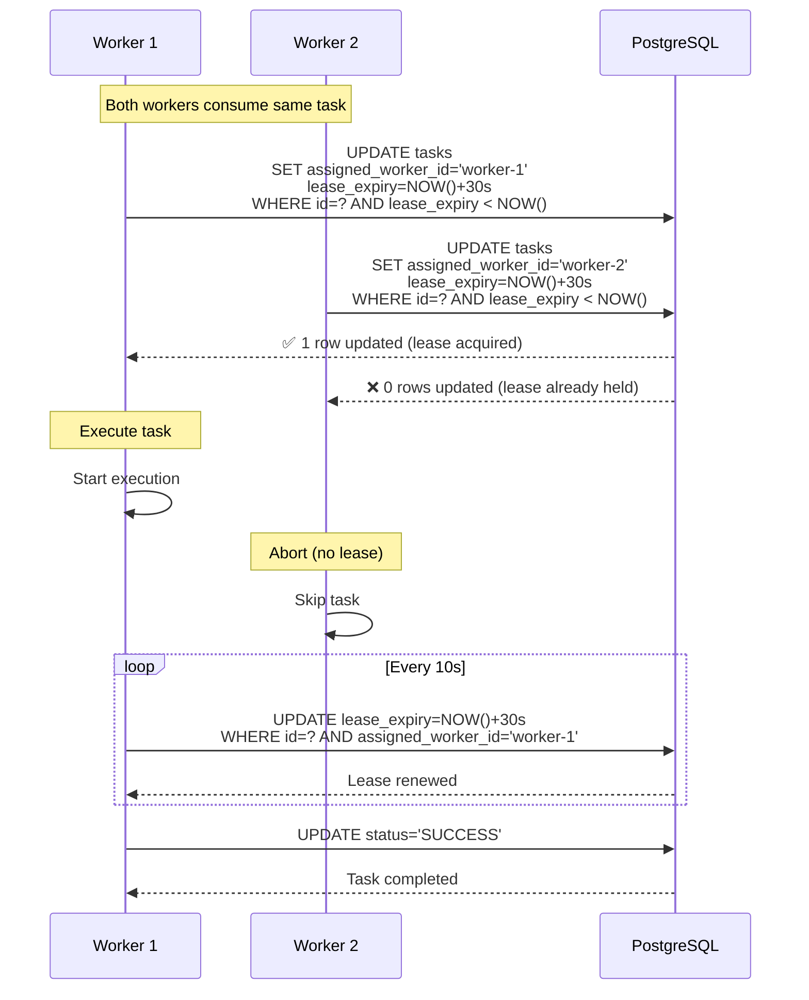

---

## 9. DLQ Monitoring Flow

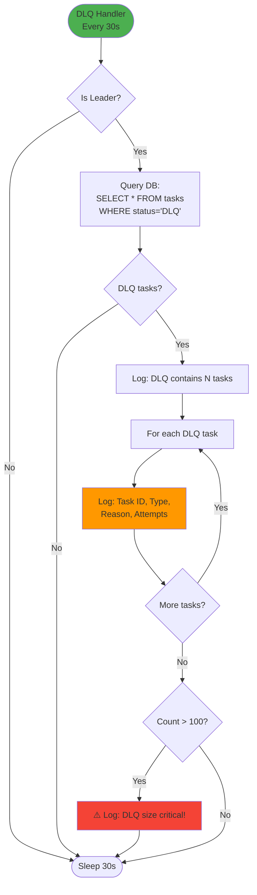

---

## 10. Failure Recovery Scenarios

### 10.1 Leader Failure

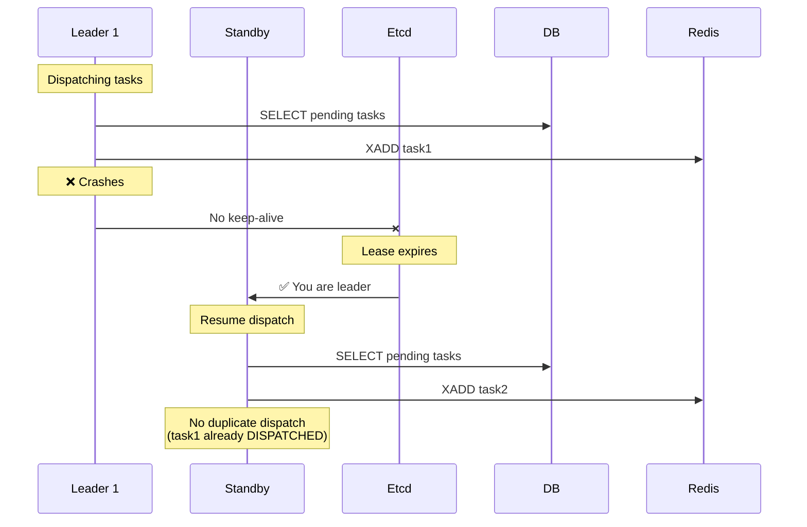

### 10.2 Worker Failure

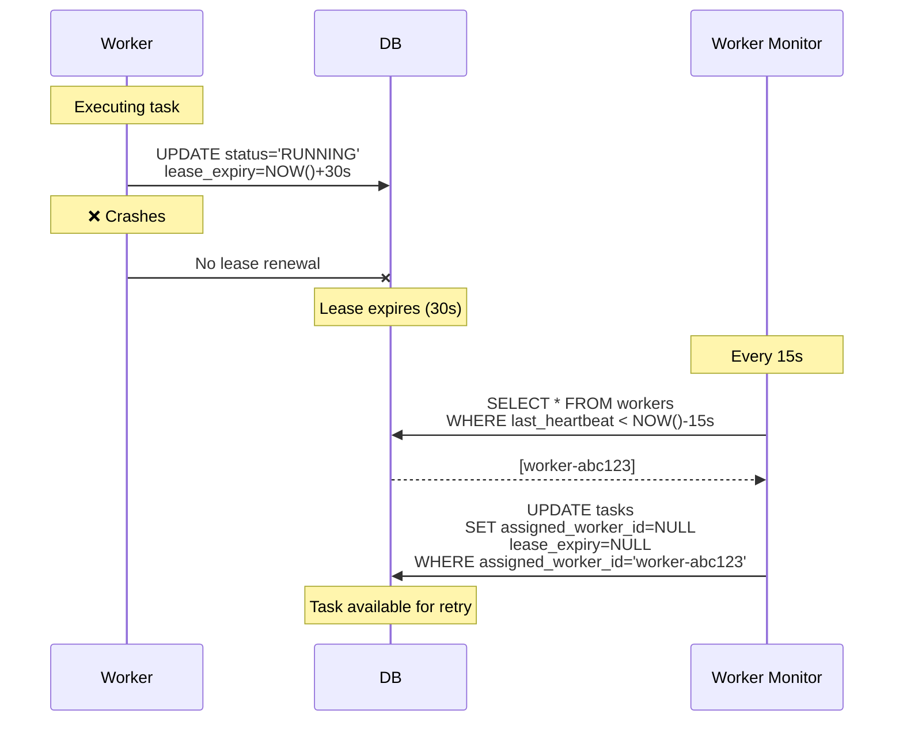

---

## 11. Data Flow Summary

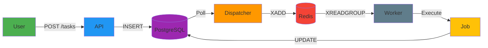

---

## 12. Component Interaction Matrix

| Component | Interacts With | Purpose |
|-----------|---------------|---------|
| **API** | PostgreSQL | Persist jobs |
| **Dispatcher** | PostgreSQL, Redis, Etcd | Poll & dispatch jobs |
| **Worker** | PostgreSQL, Redis | Execute jobs |
| **DLQ Handler** | PostgreSQL | Monitor failed jobs |
| **Worker Monitor** | PostgreSQL | Detect dead workers |
| **Leader Election** | Etcd | Coordinate dispatcher |

---

## 13. Request Flow Examples

### Example 1: Create HTTP Job

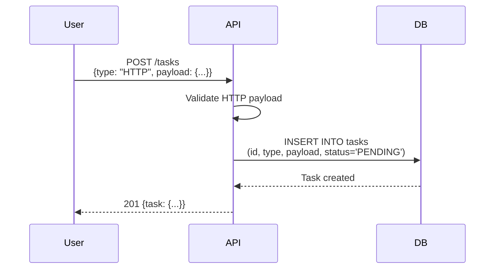

### Example 2: View Job Status

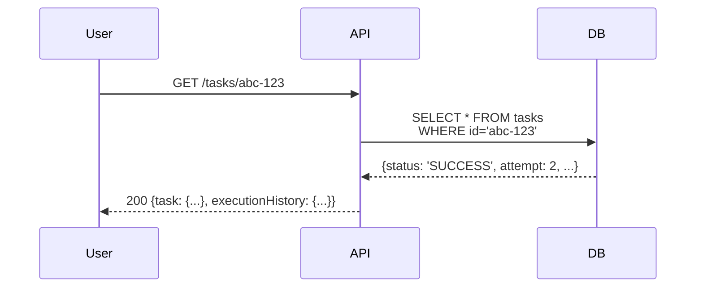

### Example 3: Manual DLQ Retry

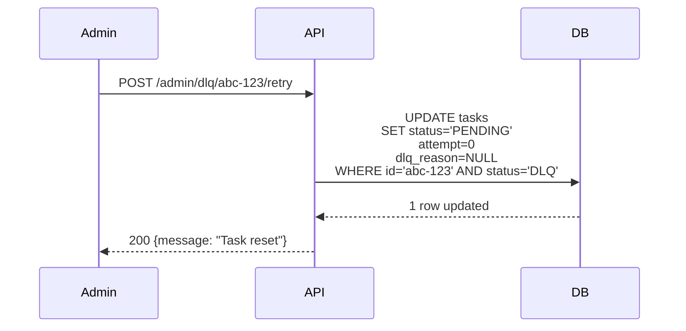

---

## 14. Time-based Scheduling

```mermaid
gantt
    title Job Scheduling Timeline
    dateFormat HH:mm:ss
    axisFormat %H:%M:%S
    
    section Job Creation
    POST /tasks (scheduled_at=12:05:00) :done, create, 12:00:00, 1s
    
    section Waiting
    Status: PENDING :active, wait, 12:00:01, 4m59s
    
    section Dispatch
    Watcher polls (12:05:00) :crit, dispatch, 12:05:00, 1s
    Push to Redis :crit, push, 12:05:01, 1s
    
    section Execution
    Worker consumes :done, consume, 12:05:02, 1s
    Acquire lease :done, lease, 12:05:03, 1s
    Execute task :active, exec, 12:05:04, 5s
    Update SUCCESS :done, success, 12:05:09, 1s
```

---

## 15. Scalability Patterns

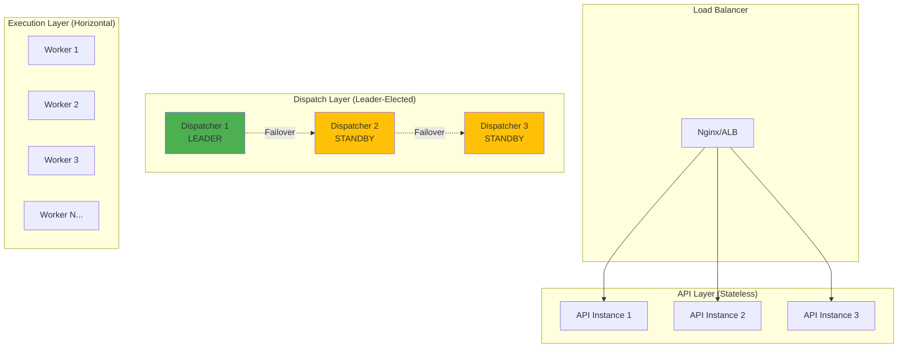

---

## Legend

- 🟢 **Active/Running** - Component is operational
- 🟡 **Standby** - Component is ready for failover
- 🔴 **Failed** - Component has crashed
- ⚠️ **Critical** - Requires attention
- ✅ **Success** - Operation completed
- ❌ **Failure** - Operation failed
