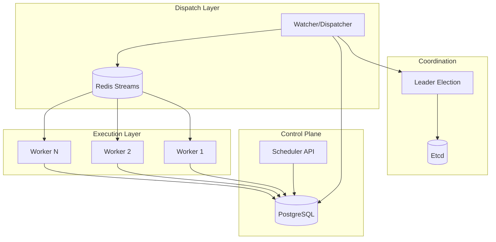

# High-Level Design (HLD)
## Distributed Task Scheduler

---

## 1. System Overview

A distributed, fault-tolerant task scheduler that executes jobs at specified times with automatic retry, failure handling, and horizontal scalability.

**Key Characteristics:**
- **Distributed:** Multiple workers, leader-elected dispatcher
- **Fault-Tolerant:** Survives leader failures, worker crashes, queue outages
- **Scalable:** Horizontal scaling of workers
- **Reliable:** Lease-based execution, automatic retries, DLQ for failed tasks

---

## 2. Architecture Principles

### 2.1 Three-Service Separation

```
┌─────────────────┐
│  Scheduler API  │  Control Plane (Accept Intent)
└────────┬────────┘
         │
         ▼
┌─────────────────┐
│   PostgreSQL    │  Source of Truth
└────────┬────────┘
         │
         ▼
┌─────────────────┐
│    Watcher      │  Time-based Dispatcher
└────────┬────────┘
         │
         ▼
┌─────────────────┐
│ Redis Streams   │  Durable Queue
└────────┬────────┘
         │
         ▼
┌─────────────────┐
│    Executor     │  Data Plane (Execute Jobs)
└─────────────────┘
```

### 2.2 Core Design Decisions

| Decision | Rationale |
|----------|-----------|
| **PostgreSQL as Source of Truth** | ACID guarantees, survives queue outages, enables replay |
| **Redis Streams for Queue** | Persistent, consumer groups, redelivery, industry-standard |
| **Leader Election (Etcd)** | Prevents duplicate dispatch, single active dispatcher |
| **Lease-based Execution** | Prevents duplicate work, enables worker failure detection |
| **Exponential Backoff** | Prevents overwhelming downstream services |
| **Dead Letter Queue** | Isolates permanently failed tasks for investigation |

---

## 3. Component Architecture

### 3.1 Service Breakdown



### 3.2 Service Responsibilities

#### **Scheduler API** (Control Plane)
- Accept job creation requests
- Validate job payload
- Persist to PostgreSQL
- Enforce idempotency
- **Does NOT** push to queue
- **Does NOT** care about execution

#### **Watcher/Dispatcher** (Time Bridge)
- Runs every 1 second (configurable)
- Queries DB for jobs where `scheduled_at <= NOW()`
- Batch pushes to Redis Streams
- Marks jobs as `DISPATCHED`
- Leader-elected (only one active)
- Handles retry loop (FAILED → PENDING)

#### **Executor/Worker** (Data Plane)
- Consumes from Redis Streams
- Acquires DB lease (prevents duplicate execution)
- Executes job (HTTP, Shell, Delay)
- Renews lease for long-running jobs
- Updates status (SUCCESS/FAILED)
- Sends heartbeats

---

## 4. Data Flow

### 4.1 Job Lifecycle

```
┌──────────┐
│  PENDING │  ← Job created via API
└────┬─────┘
     │ Watcher polls every 1s
     ▼
┌──────────┐
│DISPATCHED│  ← Pushed to Redis Streams
└────┬─────┘
     │ Worker consumes
     ▼
┌──────────┐
│ RUNNING  │  ← Lease acquired, executing
└────┬─────┘
     │
     ├─ Success ──→ ┌─────────┐
     │              │ SUCCESS │
     │              └─────────┘
     │
     └─ Failure ──→ ┌─────────┐
                    │ FAILED  │
                    └────┬────┘
                         │
                         ├─ Retry ──→ PENDING (with backoff)
                         │
                         └─ Max attempts ──→ ┌─────┐
                                              │ DLQ │
                                              └─────┘
```

### 4.2 End-to-End Flow

```
User
  │
  ▼
POST /tasks (Scheduler API)
  │
  ├─ Validate payload
  ├─ Check idempotency
  └─ INSERT INTO tasks (status='PENDING')
  │
  ▼
PostgreSQL (Source of Truth)
  │
  ▼
Watcher (Leader-elected, every 1s)
  │
  ├─ SELECT * FROM tasks WHERE status='PENDING' AND scheduled_at <= NOW()
  ├─ XADD to Redis Streams
  └─ UPDATE tasks SET status='DISPATCHED'
  │
  ▼
Redis Streams (Durable Queue)
  │
  ▼
Worker (Consumer Group)
  │
  ├─ XREADGROUP (consume message)
  ├─ UPDATE tasks SET status='RUNNING', assigned_worker_id=?, lease_expiry=NOW()+30s
  ├─ Execute job (HTTP/Shell/Delay)
  ├─ UPDATE tasks SET status='SUCCESS'/'FAILED'
  └─ XACK (acknowledge message)
  │
  ▼
PostgreSQL (Final Status)
```

---

## 5. Fault Tolerance

### 5.1 Failure Scenarios & Recovery

| Failure | Detection | Recovery |
|---------|-----------|----------|
| **Leader Crash** | Etcd lease expires | New leader elected, resumes dispatch |
| **Worker Crash** | Lease expires | Task becomes available for re-execution |
| **Redis Outage** | Connection error | Jobs remain in DB, dispatched when Redis recovers |
| **DB Outage** | Connection error | System halts, resumes when DB recovers |
| **Task Failure** | Exception caught | Retry with exponential backoff, DLQ after max attempts |

### 5.2 Guarantees

- **At-least-once execution:** Jobs may execute multiple times (idempotency required)
- **No lost jobs:** DB is authoritative, queue is transport
- **No duplicate dispatch:** Leader election ensures single dispatcher
- **Bounded retries:** Max attempts prevents infinite loops
- **Failure isolation:** DLQ prevents bad jobs from blocking queue

---

## 6. Scalability

### 6.1 Horizontal Scaling

```
                    ┌──────────────┐
                    │   Etcd       │
                    └──────┬───────┘
                           │
        ┌──────────────────┼──────────────────┐
        │                  │                  │
   ┌────▼────┐        ┌────▼────┐       ┌────▼────┐
   │Scheduler│        │Scheduler│       │Scheduler│
   │Instance1│        │Instance2│       │Instance3│
   │(Leader) │        │(Standby)│       │(Standby)│
   └────┬────┘        └─────────┘       └─────────┘
        │
        ▼
   ┌─────────────────────────────────────────┐
   │           Redis Streams                 │
   └────┬────────────┬────────────┬──────────┘
        │            │            │
   ┌────▼────┐  ┌────▼────┐  ┌────▼────┐
   │Worker 1 │  │Worker 2 │  │Worker N │
   └─────────┘  └─────────┘  └─────────┘
```

**Scaling Characteristics:**
- **API:** Stateless, scale horizontally behind load balancer
- **Dispatcher:** Single active (leader-elected), instant failover
- **Workers:** Scale horizontally, consumer groups distribute load
- **Database:** Vertical scaling, read replicas for queries

### 6.2 Performance Characteristics

| Metric | Value | Notes |
|--------|-------|-------|
| Dispatch Latency | ~1s | Watcher poll interval |
| Execution Latency | <100ms | Queue → Worker |
| Throughput | ~1000 jobs/s | Limited by DB writes |
| Worker Scaling | Linear | Add workers for more throughput |

---

## 7. Monitoring & Observability

### 7.1 Key Metrics

- **Dispatch Lag:** Time between `scheduled_at` and actual dispatch
- **Queue Depth:** Number of pending messages in Redis
- **Worker Count:** Active workers with recent heartbeats
- **Job Statistics:** Success/failure rates, retry counts
- **DLQ Size:** Number of permanently failed tasks

### 7.2 Health Checks

- `GET /health` - API liveness
- `GET /system/status` - System-wide health (leader, workers, queue, stats)

---

## 8. API Surface

### 8.1 Job Management

- `POST /tasks` - Create job
- `GET /tasks` - List jobs (with filters)
- `GET /tasks/:id` - Get job details + execution history
- `POST /tasks/:id/run-now` - Trigger immediate execution

### 8.2 Admin Operations

- `POST /admin/scheduler/enable` - Enable dispatcher
- `POST /admin/scheduler/disable` - Disable dispatcher
- `GET /admin/dlq` - View DLQ tasks
- `POST /admin/dlq/:id/retry` - Retry from DLQ
- `POST /admin/faults/*` - Fault injection (testing)

---

## 9. Technology Stack

| Component | Technology | Justification |
|-----------|-----------|---------------|
| **API** | Node.js + Express | Async I/O, simple, fast |
| **Database** | PostgreSQL | ACID, JSONB, reliable |
| **Queue** | Redis Streams | Persistent, consumer groups, simple |
| **Coordination** | Etcd | Leader election, distributed locks |
| **Frontend** | React + Vite | Modern, fast, component-based |

---

## 10. Interview Talking Points

### 10.1 Design Highlights

> **"The database is the single source of truth; queues are only delivery mechanisms."**

This prevents dual-write bugs and ensures jobs survive queue outages.

> **"The watcher bridges wall-clock time and asynchronous execution."**

Separating scheduling from execution allows independent scaling and failure recovery.

> **"We use Redis Streams as a durable, replayable dispatch layer."**

Consumer groups enable horizontal scaling while maintaining delivery guarantees.

### 10.2 Production Readiness

- ✅ Leader election prevents split-brain
- ✅ Lease-based execution prevents duplicate work
- ✅ Exponential backoff prevents thundering herd
- ✅ DLQ isolates bad jobs
- ✅ Idempotency keys prevent duplicate creation
- ✅ Batch dispatch reduces DB load

---

## 11. Future Enhancements

- **Cron-style scheduling:** Recurring jobs
- **Job dependencies:** DAG execution
- **Priority queues:** High/low priority jobs
- **Rate limiting:** Per-user/per-job-type limits
- **Observability:** Prometheus metrics, distributed tracing
- **Multi-tenancy:** Namespace isolation
