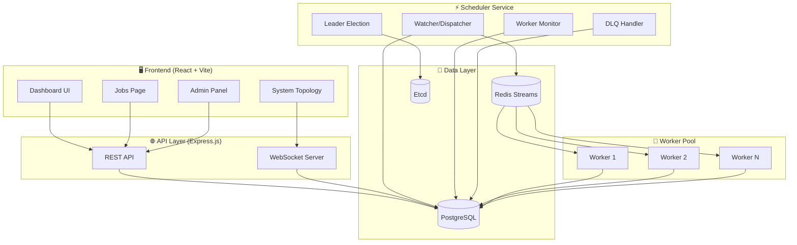
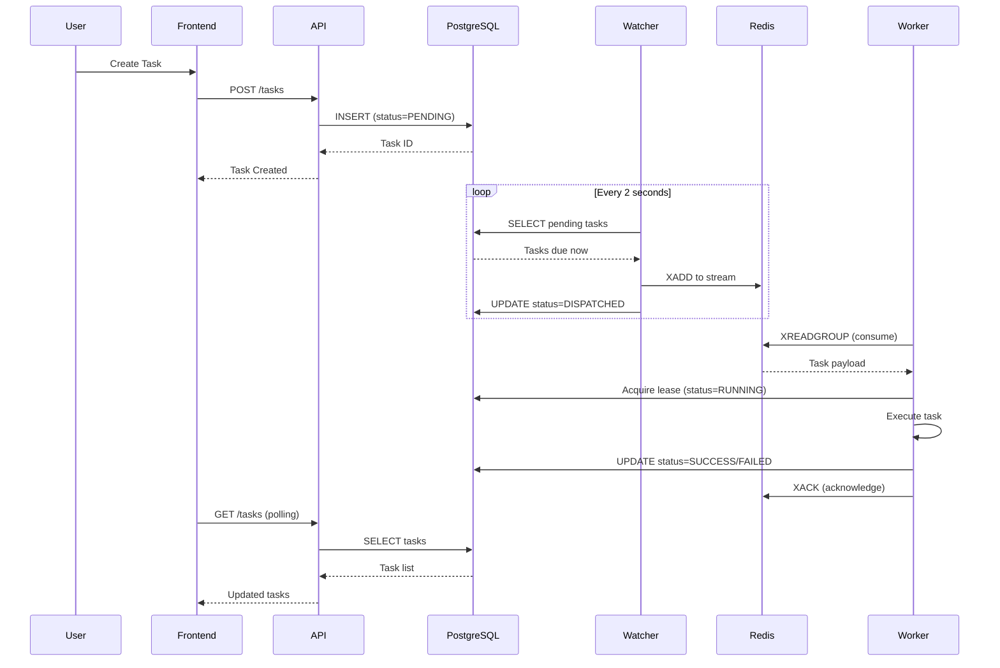
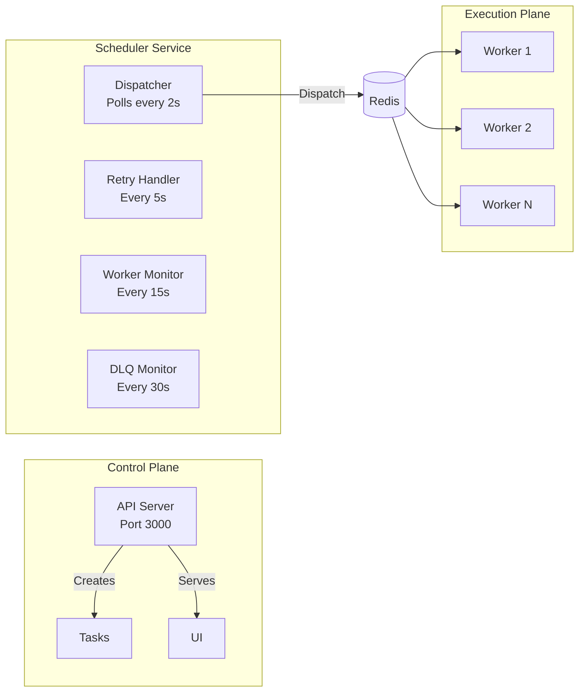
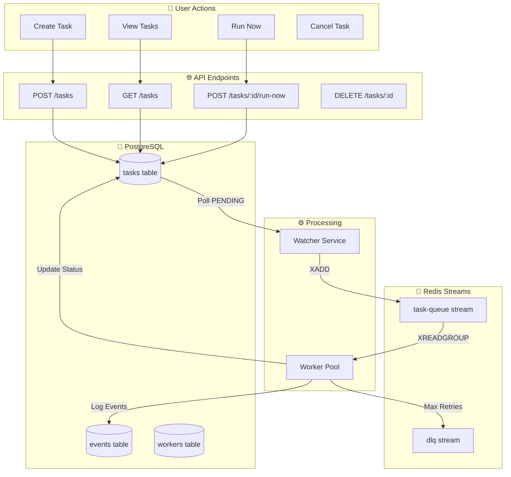
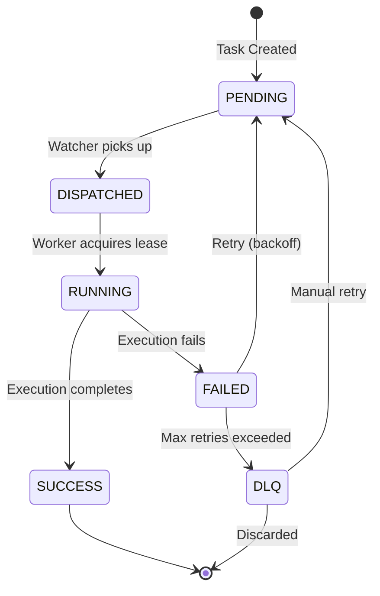
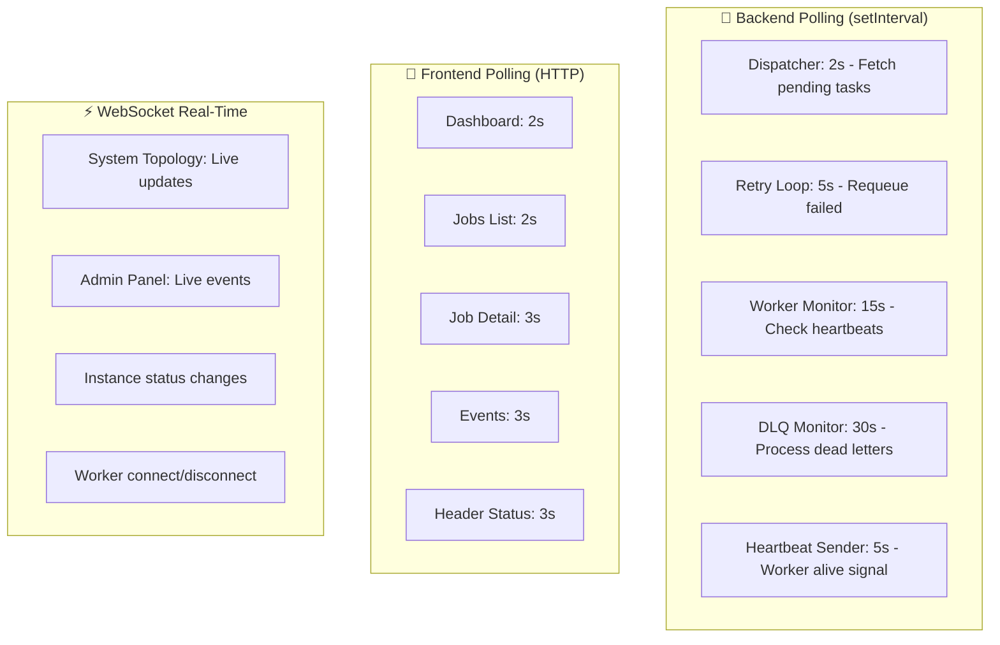
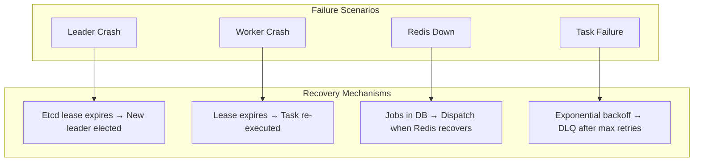

# Detailed High-Level Design (HLD)
## Distributed Task Scheduler - Complete Architecture

---

## 1. System Architecture Overview

---

## 2. Component Interaction Flow

---

## 3. Frontend Pages & What They Show

| Page | URL | Data Source | Update Method |
|------|-----|-------------|---------------|
| **Dashboard** | `/` | System stats, queue depth | Polling (2s) |
| **Jobs** | `/jobs` | Task list with filters | Polling (2s) |
| **Job Detail** | `/jobs/:id` | Single task + history | Polling (3s) |
| **Schedule** | `/schedule` | Upcoming tasks | Polling (3s) |
| **Admin** | `/admin` | System controls, chaos | WebSocket |
| **Topology** | (component) | Live system topology | WebSocket |

---

## 4. Backend Services & Responsibilities

---

## 5. Data Flow Diagram

---

## 6. Job Lifecycle State Machine

---

## 7. Polling vs WebSocket Usage

---

## 8. Technology Stack

| Layer | Technology | Purpose |
|-------|------------|---------|
| **Frontend** | React + Vite | SPA with modern UI |
| **Styling** | CSS + Glassmorphism | Dark theme, animations |
| **API** | Express.js | REST + WebSocket |
| **Real-time** | Socket.IO | Live updates |
| **Database** | PostgreSQL | Source of truth |
| **Queue** | Redis Streams | Task dispatch |
| **Coordination** | Etcd | Leader election |

---

## 9. Network Ports

| Service | Port | Protocol |
|---------|------|----------|
| Frontend (dev) | 5173 | HTTP |
| API Server | 3000 | HTTP + WS |
| PostgreSQL | 5432 | TCP |
| Redis | 6379 | TCP |
| Etcd | 2379 | gRPC |

---

## 10. Fault Tolerance

