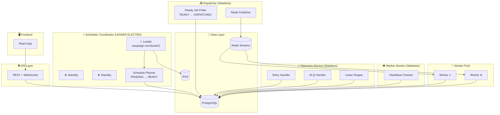
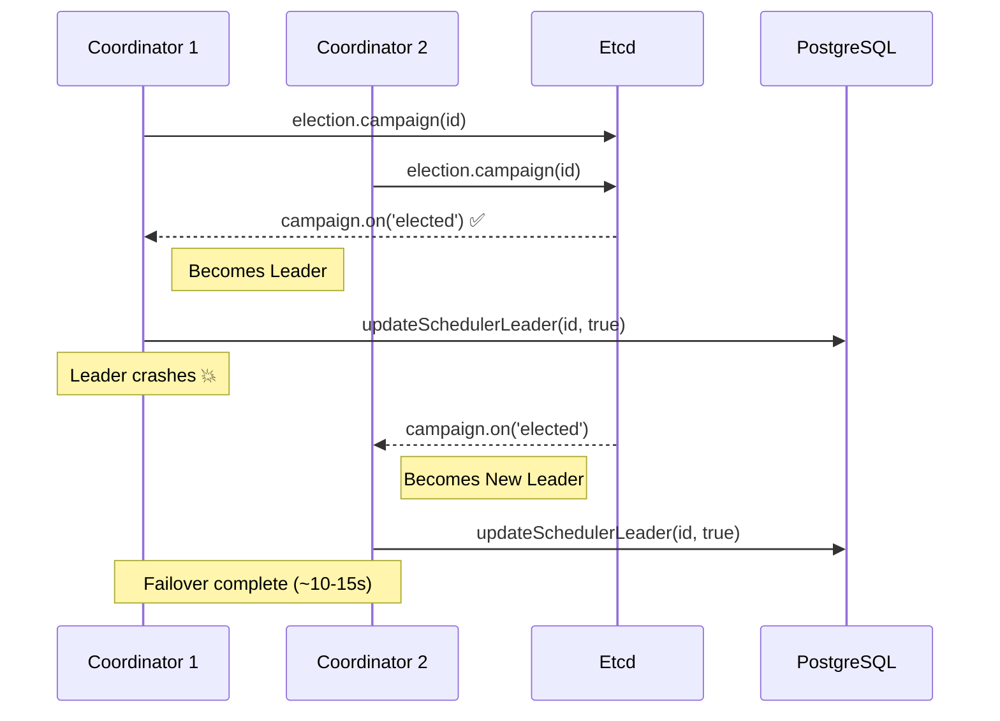
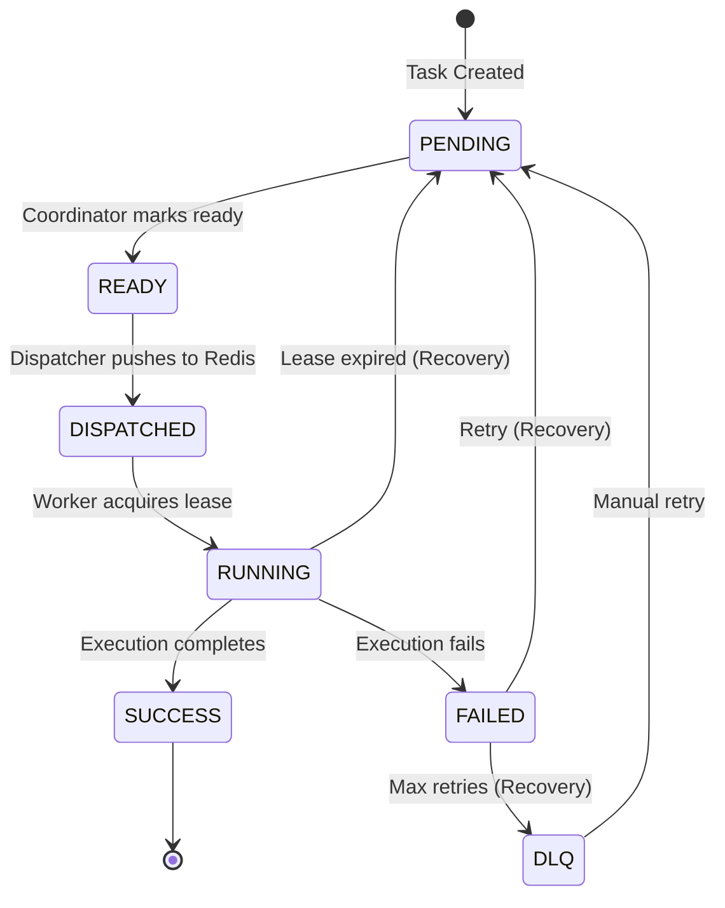

# Refactored High-Level Design (V2)
## Distributed Task Scheduler - SRP Architecture

This is the refactored design following the Single Responsibility Principle with properly decoupled services and event-based leader election.

---

## Architecture Overview



---

## Leader Election - Event-Based Campaign Pattern

The Scheduler Coordinator uses **etcd3's event-based campaign** for reliable leader election:



### Key Implementation Details

```javascript
// leader-election.js - Event-based pattern
async _campaign() {
    this.campaign = this.election.campaign(this.electionKey);

    // Properly detects when THIS node becomes leader
    this.campaign.on('elected', () => {
        this.isLeader = true;
        this.emit('elected');
    });

    // Properly detects when THIS node loses leadership
    this.campaign.on('lost', () => {
        this.isLeader = false;
        this.emit('demoted');
        // Re-campaign after losing
        if (this.campaigning) {
            setTimeout(() => this._campaign(), 1000);
        }
    });
}
```

---

## Service Responsibilities

| Service | Leader? | State | Responsibility |
|---------|---------|-------|----------------|
| **Scheduler Coordinator** | ✅ Yes | Stateful | Mark PENDING → READY when `scheduled_at <= NOW()` |
| **Dispatcher** | ❌ No | Stateless | Poll READY tasks, push to Redis, mark DISPATCHED |
| **Recovery Service** | ❌ No | Stateless | Handle retries, DLQ, expired leases |
| **Worker Monitor** | ❌ No | Stateless | Check heartbeats, emit failure events |
| **Worker** | ❌ No | Stateless | Consume from Redis, execute tasks |

---

## Job Lifecycle (V2)



---

## Data Flow

```
1. API → DB (PENDING)
2. Scheduler Coordinator → DB (PENDING → READY)  ← Leader-gated, event-based
3. Dispatcher → Redis (READY → Redis → DISPATCHED)  ← Stateless
4. Worker → Redis → DB (DISPATCHED → RUNNING → SUCCESS)
5. Recovery → DB (FAILED → PENDING or DLQ)  ← Stateless
```

---

## npm Scripts

```bash
# SRP Services (V2)
npm run start:coordinator   # Scheduler Coordinator (leader-elected)
npm run start:dispatcher    # Dispatcher (stateless)
npm run start:recovery      # Recovery Service (stateless)
npm run start:monitor       # Worker Monitor (stateless)

# Existing
npm run start:api           # API Server
npm run start:worker        # Worker
```

---

## Key Design Decisions

1. **Leader election only gates scheduling** - not dispatch or recovery
2. **Event-based campaign pattern** - Uses `campaign.on('elected')` / `campaign.on('lost')` for reliable leadership changes
3. **READY state** - Clean handoff between Coordinator and Dispatcher
4. **Atomic DB updates** - Transaction for leader status, `FOR UPDATE SKIP LOCKED` for tasks
5. **Stateless services** - Dispatcher, Recovery, Monitor can scale horizontally

---

## draw.io Diagram

See: [HLD_V2_SRP_Architecture.drawio](./HLD_V2_SRP_Architecture.drawio)
