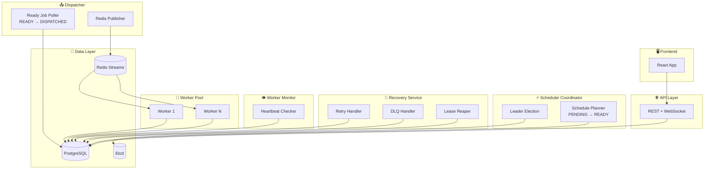
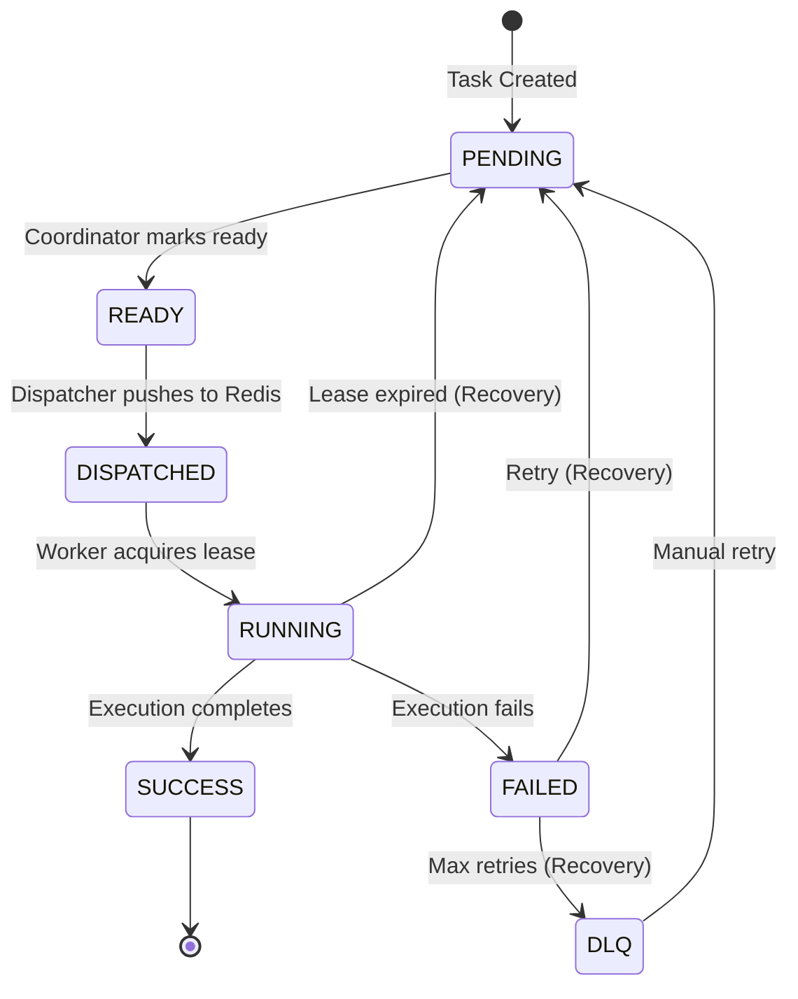

# Refactored High-Level Design (V2)
## Distributed Task Scheduler - SRP Architecture

This is the refactored design following the Single Responsibility Principle.

---

## Architecture Overview



---

## Service Responsibilities

| Service | Leader? | Responsibility |
|---------|---------|----------------|
| **Scheduler Coordinator** | ✅ Yes | Mark PENDING → READY when `scheduled_at <= NOW()` |
| **Dispatcher** | ❌ No | Poll READY tasks, push to Redis, mark DISPATCHED |
| **Recovery Service** | ❌ No | Handle retries, DLQ, expired leases |
| **Worker Monitor** | ❌ No | Check heartbeats, emit failure events |
| **Worker** | ❌ No | Consume from Redis, execute tasks |

---

## Job Lifecycle (V2)



---

## Data Flow

```
1. API → DB (PENDING)
2. Scheduler Coordinator → DB (PENDING → READY)  ← Leader-gated
3. Dispatcher → Redis (READY → Redis → DISPATCHED)  ← Stateless
4. Worker → Redis → DB (DISPATCHED → RUNNING → SUCCESS)
5. Recovery → DB (FAILED → PENDING or DLQ)  ← Stateless
```

---

## npm Scripts

```bash
# New SRP Services
npm run start:coordinator   # Scheduler Coordinator (leader-elected)
npm run start:dispatcher    # Dispatcher (stateless)
npm run start:recovery      # Recovery Service (stateless)
npm run start:monitor       # Worker Monitor (stateless)

# Existing
npm run start:api           # API Server
npm run start:worker        # Worker
npm run start:scheduler     # Legacy (still works)
```

---

## Key Design Decisions

1. **Leader election only gates scheduling** - not dispatch or recovery
2. **READY state** - clean handoff between Coordinator and Dispatcher
3. **Atomic queries** - `FOR UPDATE SKIP LOCKED` prevents race conditions
4. **Stateless services** - Dispatcher, Recovery, Monitor can scale horizontally
