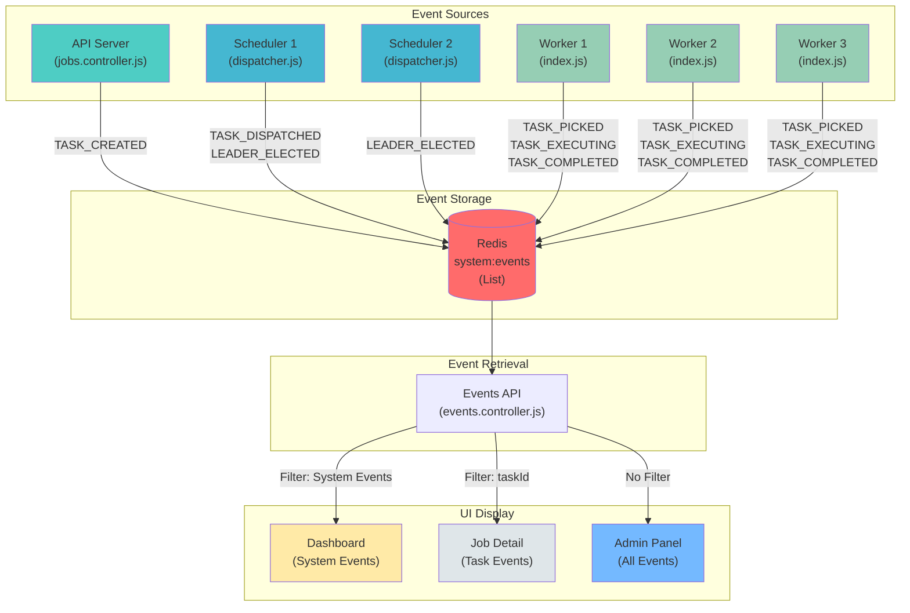

# Event Logging System Architecture

## Event Flow Diagram

## Event Types by Source

### API Server
- `TASK_CREATED` - When task is created via POST /tasks

### Scheduler (Leader Only)
- `TASK_DISPATCHED` - When task is pushed to Redis queue
- `LEADER_ELECTED` - When scheduler becomes leader

### Workers
- `TASK_PICKED` - When worker consumes task from Redis
- `TASK_EXECUTING` - When worker starts task execution
- `TASK_COMPLETED` - When task finishes successfully
- `TASK_FAILED` - When task execution fails

### Admin Controller
- `SCHEDULER_ENABLED` - When scheduler is enabled
- `SCHEDULER_DISABLED` - When scheduler is disabled

## Data Flow

1. **Event Logging**: Each process calls `eventLogger.log(type, message, metadata)`
2. **Redis Storage**: Event is pushed to Redis list (`LPUSH system:events`)
3. **Event Retrieval**: API endpoint queries Redis (`LRANGE system:events`)
4. **UI Filtering**: Frontend filters events based on scope (dashboard/task/admin)

## Key Design Decisions

### Why Redis?
- **Cross-Process**: All processes (API, 2 schedulers, 3 workers) share the same event log
- **Fast**: In-memory storage with O(1) push/pop operations
- **Simple**: No complex database schema needed
- **Ephemeral**: Events are temporary (last 200 events), perfect for demo/debugging

### Why 3-Tier Display?
- **Dashboard**: Users want high-level system health, not task noise
- **Job Detail**: Users debugging a specific task need its complete lifecycle
- **Admin**: Administrators need full visibility for troubleshooting

### Why Absolute Timestamps?
- **Performance**: Relative time ("5s ago") requires re-rendering every second
- **Precision**: Absolute timestamps are more useful for debugging
- **Simplicity**: No complex time calculation logic
