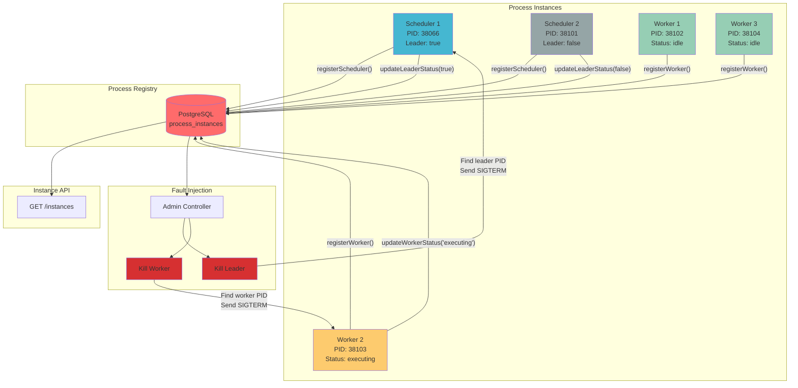
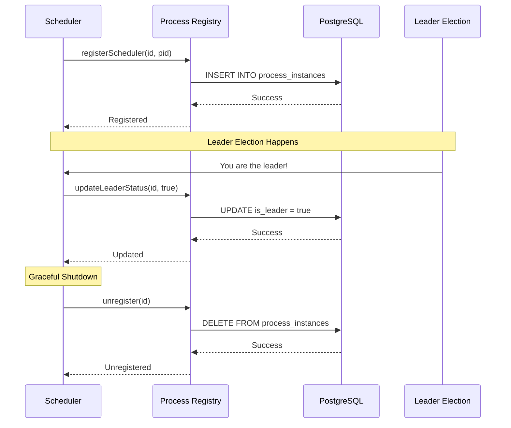
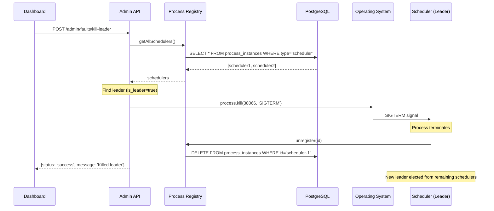

# Process Registry Architecture

## System Overview



## Database Schema

```sql
CREATE TABLE process_instances (
    id VARCHAR(255) PRIMARY KEY,           -- scheduler-abc123 or worker-xyz789
    type VARCHAR(50) NOT NULL,             -- 'scheduler' or 'worker'
    pid INTEGER NOT NULL,                  -- Process ID
    is_leader BOOLEAN DEFAULT FALSE,       -- For schedulers only
    status VARCHAR(50),                    -- For workers: 'idle' or 'executing'
    current_task_id VARCHAR(255),          -- For workers: current task
    started_at TIMESTAMP DEFAULT NOW(),
    updated_at TIMESTAMP DEFAULT NOW()
);
```

## Registration Flow



## Fault Injection Flow



## Key Features

### 1. Database-Based Tracking
- **Reliability**: PostgreSQL ensures data persistence
- **Atomic Operations**: ACID guarantees for concurrent updates
- **Query Flexibility**: Easy to filter by type, status, leader

### 2. Real-Time Updates
- **Leader Election**: `updateLeaderStatus()` called immediately
- **Worker Status**: `updateWorkerStatus()` on task start/end
- **Graceful Shutdown**: `unregister()` on process exit

### 3. Fault Injection Support
- **Targeted Killing**: Find exact PID by instance ID
- **Leader Targeting**: Kill current leader to trigger re-election
- **Worker Targeting**: Kill specific worker by ID

### 4. Automatic Cleanup
- **Startup**: `DELETE FROM process_instances` clears stale entries
- **Shutdown**: Each process unregisters itself
- **Crash Recovery**: Stale entries cleaned on next startup

## Integration Points

### Scheduler
```javascript
// On startup
await processRegistry.registerScheduler(SCHEDULER_ID, process.pid);

// On leader election
await processRegistry.updateLeaderStatus(SCHEDULER_ID, true);

// On leader loss
await processRegistry.updateLeaderStatus(SCHEDULER_ID, false);

// On shutdown
await processRegistry.unregister(SCHEDULER_ID);
```

### Worker
```javascript
// On startup
await processRegistry.registerWorker(WORKER_ID, process.pid);

// Before task execution
await processRegistry.updateWorkerStatus(WORKER_ID, 'executing', taskId);

// After task completion
await processRegistry.updateWorkerStatus(WORKER_ID, 'idle', null);

// On shutdown
await processRegistry.unregister(WORKER_ID);
```

### Admin API
```javascript
// Kill leader
const schedulers = await processRegistry.getAllSchedulers();
const leader = schedulers.find(s => s.isLeader);
process.kill(leader.pid, 'SIGTERM');

// Kill worker
const workers = await processRegistry.getAllWorkers();
const worker = workers.find(w => w.id === workerId);
process.kill(worker.pid, 'SIGTERM');
```

## Benefits

1. **100% Reliable**: Database-based, survives process crashes
2. **Real-Time**: Immediate updates on status changes
3. **Fault Injection**: Enables targeted process termination
4. **Dashboard Visibility**: Shows live instance status
5. **Multi-Instance Support**: Tracks 2 schedulers + 3 workers
6. **Clean Startup**: Automatic cleanup of stale entries
